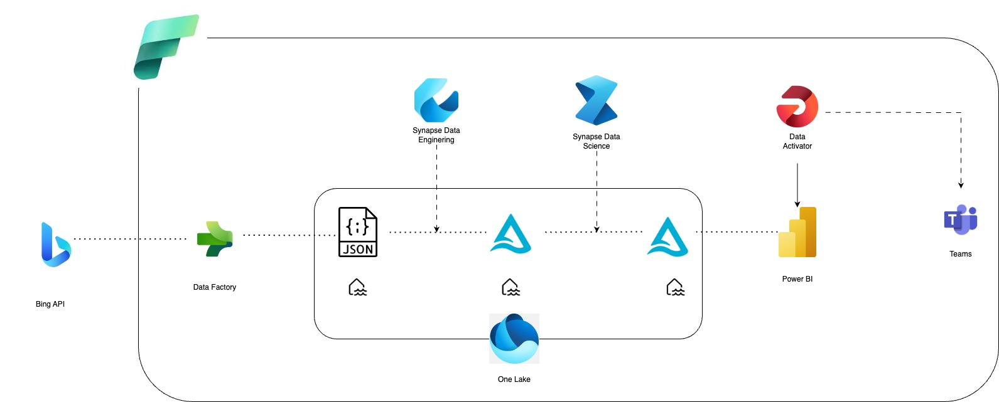

# Bing News Analysis Pipeline using Microsoft Fabric

The idea behind this project is to build a data pipeline that:
- Alerts users of significant changes based on sentiment analysis of text data/ news items of a search engine
- Present these changes as metrics of a user-friendly Power-BI Dashboard.

## Overview of the project Architecture

This is the architecture of the end-to-end pipeline built in the Azure Platform:

- As the data source, I have used Bing API availabe in the Azure portal.
- For various processes like ingestion, transformation, storage, alerting system and orchestration of the entire pipeline, I have used all     the tools available as part of Microsoft Fabric .
- Here's a detailed list of tools used within ** Microsoft Fabric** :
  -  **Data Factory** for data ingestion from the API, and end-to-end pipeline orchestration
  -  **One Lake** for data storage and Lake Database as the database
  -  **Synapse Data Engineering** for transforming the raw data into clean delta tables in the Lake Database , using spark notebooks for all the      processing
  -  **Synapse Data Science** to perform  sentiment analysis on the news(text) data
  -  **Power BI** for creating a dashboard that captures the sentiment of the news as a metric
  -  **Data Activator** to configure alerts to be sent to Teams

 
The project is organized into separate folders for each step, documenting the procedure to build each component as follows:
1. [Environment Setup](./01_Environment%20Setup)
2. [Data Ingestion](./02_Data%20Ingestion)
3. [Data Transformation](./03_Data%20Transformation)
4. [Sentiment Analysis](./04_Sentiment%20Analysis)
5. [Report Building and Pipeline Automation ](./05_Pipeline%20Automation)
6. [Setting Up Alerts and End to End Testing](./06_Setting%20Up%20Alerts%20and%20End%20to%20End%20Testing)

